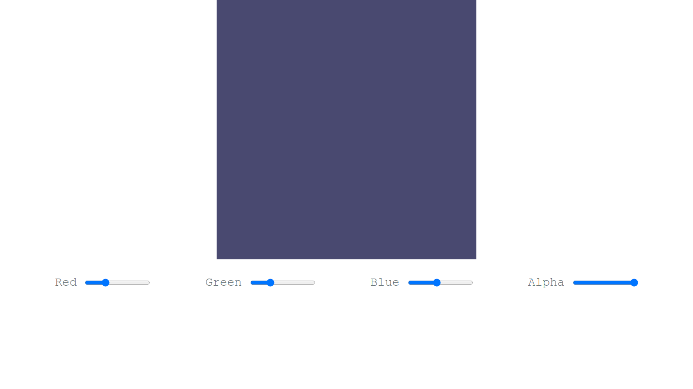
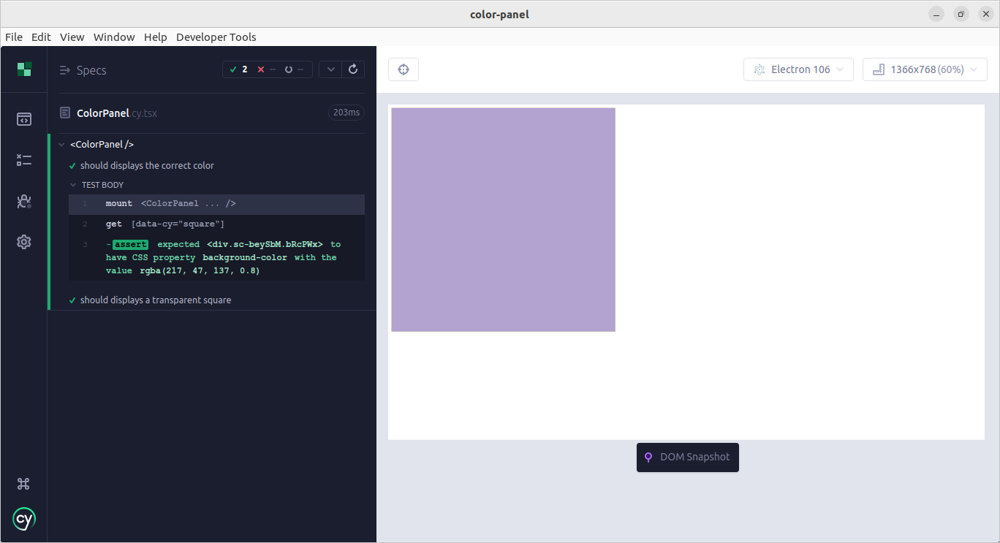
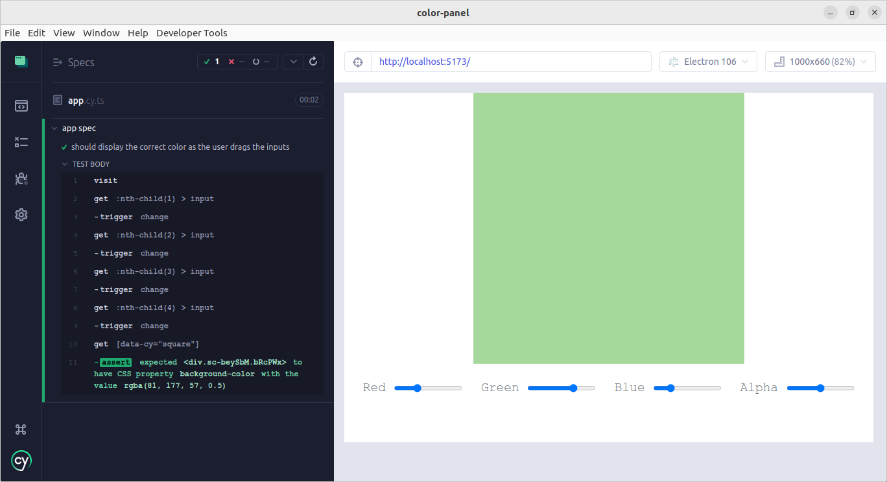

# color-panel

## Sumário

- [color-panel](#color-panel)
  - [Sumário](#sumário)
  - [Motivação](#motivação)
  - [Pilha de tecnologia](#pilha-de-tecnologia)
  - [Galeria](#galeria)
  - [Como rodar](#como-rodar)
    - [Pré-requisitos](#pré-requisitos)
    - [Passo a passo](#passo-a-passo)

## Motivação

Este app consiste em um seletor de cores que recebe um código RGBA informado pelo usuário através de controles deslizantes, como exemplificado pela [galeria de fotos](#galeria), e exibe a cor resultante. O componente [`ColorPanel`](./src/components/ColorPanel/index.tsx) e seu fluxo de troca de cor de plano de fundo foram testados e os respectivos testes estão disponíveis nos diretórios [`component/`](./cypress/component/ColorPanel.cy.tsx) e [`e2e/`](./cypress/e2e/app.cy.ts), respectivamente.

Este foi o terceiro repositório de código apresentado no [Curso Superior de TSI do IFMS](https://www.ifms.edu.br/campi/campus-aquidauana/cursos/graduacao/sistemas-para-internet/sistemas-para-internet) como requisito para obtenção da nota parcial das atividades da unidade curricular Construção de Páginas Web IV.

| [&larr; Repositório anterior](https://github.com/mdccg/react-cypress/) | [Próximo repositório &rarr;](https://github.com/mdccg/evolved-dictionary/) |
|-|-|

## Pilha de tecnologia

As seguintes tecnologias foram utilizadas para desenvolver este app:

| Papel | Tecnologia |
|-|-|
| Ambiente de execução | [Node](https://nodejs.org/en/) |
| Linguagem de programação | [TypeScript](https://www.typescriptlang.org/) |
| Biblioteca de interface de usuário | [React](https://reactjs.org/) |
| Empacotador de módulos | [Vite](https://vitejs.dev/) |
| Framework de teste | [Cypress](https://www.cypress.io/) |

## Galeria





## Como rodar

### Pré-requisitos

- [Node](https://nodejs.org/en/download/);
- [Yarn](https://yarnpkg.com/) (opcional).

### Passo a passo

1. Clone o repositório de código em sua máquina;

2. Abra um shell de comando de sua preferência (prompt de comando, PowerShell, terminal _etc_.);

3. Instale as dependências do projeto através do seguinte comando:

```console
$ npm install
```

Caso esteja utilizando o gerenciador de pacotes Yarn, execute o seguinte comando como alternativa:

```console
$ yarn
```

4. Execute o seguinte comando para iniciar o app:

Para npm:

```console
$ npm run dev
```

Para Yarn:

```console
$ yarn dev
```

5. Execute o Cypress através do seguinte comando:

Para npm:

```console
$ npm run cy:open
```

Para Yarn:

```console
$ yarn cy:open
```

6. O comando acima abrirá uma janela do Cypress solicitando que selecione o tipo de teste: E2E (teste de ponta a ponta) e Component (teste de componente). Selecione a opção desejada;

7. Selecionada a opção desejada, será solicitado que selecione um navegador web para executar os testes. É recomendado selecionar o navegador Electron, pois o mesmo foi desenvolvido pelo time do framework Cypress e contém ferramentas integradas que podem colaborar com a escrita dos testes unitários;

8. Selecionado o navegador web, os testes unitários, seja de ponta a ponta ou de componente, serão apresentados por diretório para que você os selecione para que sejam executados.
